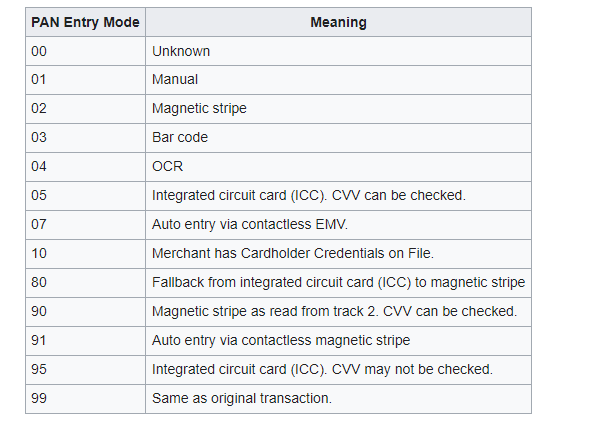
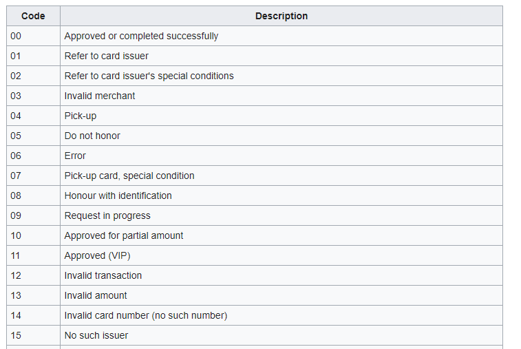

## ISO 8583
Consists of the following
- header
- MTI
- bitmap
	- primary
	- secondary
- data elements

#### header
- it is network specific `[Visa, Mastercard]`, and shows Institution Identification Codes (IICs)
- example of a header is 0158 which depicts the content of the message (mti+bitmap+data elements) is 158 bytes 

#### MTI
- message type indicator includes which version of ISO 8583 [1987, 1993, and 2003] is being used, as well as the message class, the message function and the message origin
- applications use the Message Type Indicator to determine whether the message requires a response and the format of the response
- 4 digits
    - Digit 1 indicates the version of ISO 8583
    - Digit 2 indicates the class of the message
    - Digit 3 indicates the function of the message
    - Digit 4 indicates who initiated the communication
- example 0110
    - 0xxx → version of ISO 8583 (0 = 1987 version)
    - x1xx → class of the message (1 = authorization message)
    - xx1x → function of the message (1 = response)
    - xxx0 → who began the communication (0 = acquirer)
- This means that MTI 0110 is an authorization response message stating that the actual financial transaction was originated by the acquirer.
	
#### bitmaps
- indicates whether there are other data elements or data element sub-fields somewhere else in the message
- primary bitmap specifies whether fields 1 – 64 are present
- secondary bitmap in the message, it indicates whether fields 65 – 128 exist
- example
    - given bitmap 70 10 00 11 02 C0 48 04
        - 70 (hex) to binay is -> 0111 0000
            - 0111 0000 has 8 fiels [field 1 to field 8]
            - counting from left:
                - field 1 is not present because value is 0 
                - fields 2,3,4 are present because value is 1
					
        - 10 (hex) to binay is -> 0001 0000
            - 0001 0000 again has 8 fields [field 9 to 16]
            - counting from left:
                - fields 9,10,11 are 0 meaning they are not present
                - this message shows field 12 is present
					
        - 00 -> binary = 0000 0000
            - means no fields are present in fields 17 - 24
				
        - 11 -> binary = 0001 0001
            - has 8 fields [field 25 to 32]
            - this part means fields 28 and 32 are present
				
        - 02 -> binary = 0000 0010
            - has fields [ field 33 to 40]
            - this part means field 39 is present
				
        - C0 -> binary = 1100 0000
            - fields 41 - 48
            - means fields 41 and 42 are present
				
        - 48 -> binary = 0100 1000
            - fields 49 - 56
            - means 50 and 53 are present
				
        - 04 -> binary = 0000 0100
            - fields 57 - 64
            - means field 62 is present
				
#### data elements
- Message data elements are defined by the ISO 8583 protocol, and each individual data element contains the information for that specific transaction and each has a specified meaning
- The data elements and code values relating to the transaction, includes amounts, times, dates, and country codes
- example 
    - Bit value 2 is assigned to primary account number, Bit 3 is assigned to processing code, Bit 4 is for transaction amount, etc
    - x + n Numeric (amount) values, where the first byte is either 'C' to indicate a positive or credit value, or 'D' to indicate a negative or Debit value, followed by the numeric value (using n digits)
			
***

- Binary Data
	- In data structures, packed binary data usually signifies that there are more bit combinations used to encode the message
	- unpacked signifies that some bit combinations remain unused
	- ISO 8583 defines two different encoding methods
		- Packed - or 8 bytes of data
		- Unpacked - or 16 bytes as hexadecimal characters

### Processing code
The following is a table specifying the message type and processing code for each transaction type

| Transaction     | Message Type | Processing Code  |
|-----------------|----------|------------------|
| Authorization   | 0100     | 00 a0 0x         |
| Balance Enquiry | 0110     | 31 a0 0x         |
| Sale	           | 0200	  | 00 a0 0x         |
| Cash	           | 0200     | 01 a0 0x         |
| Credit Voucher  | 0200     | 20 a0 0x         |
| Void            | 0200     | 02 a0 0x         |
| Mobile topup    | 57 a0 0x |                  |

### Service entry mode values
The Point Of Service (POS) entry mode value has 2 parts
- PAN entry mode value - the first 2 digits
- PIN entry capability - the third digit

	
	
### Credit Card Issuer Response Codes
An authorization request on a credit card can be denied for a variety of reasons, 
often with a different financial request issuer response on each occasion.

The following table shows response codes and their meanings for ISO 8583-1987, 
later versions uses 3 and 4 digit response codes.

### How are messages processed ?
ISO 8583 financial messages consist of a request/response message which is sent between two 
parties to process the financial transaction. A TCP or other connection type such as:
- UDP
- X.25
- SDLC
- SNA
- ASYNC
- QTP
- SSL
- HTTP
- or another custom connection is opened between the two partie
	
	
	
	
	
	
	
	
			
			
			
			
			